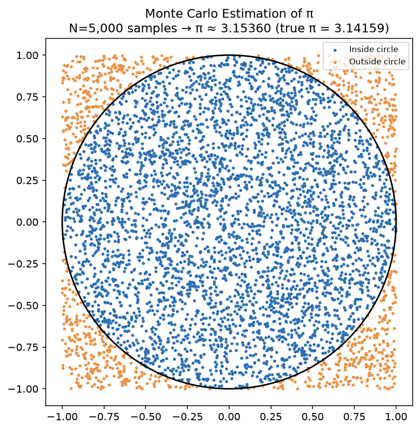
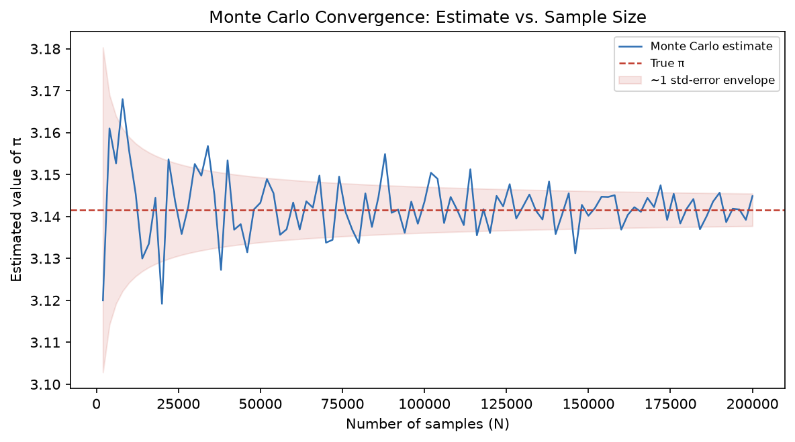
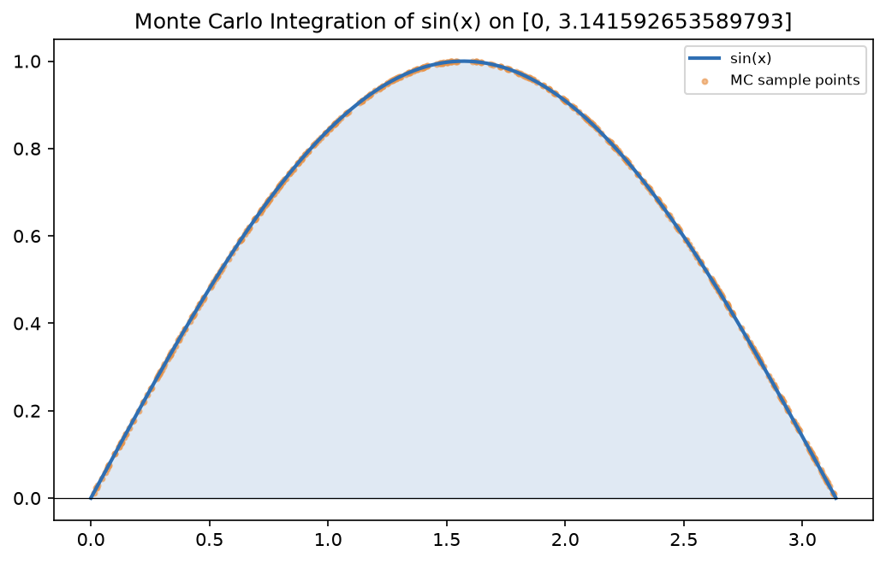
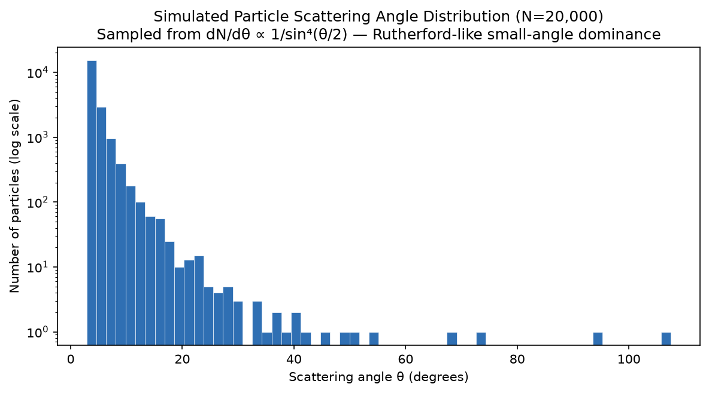

<div align="center">

# 🎲 Monte Carlo Simulation Toolkit
### Random Sampling for Scientific Computing — π Estimation, Numerical Integration & Particle Scattering

[](https://github.com/shdbfrz/monte-carlo-simulation/actions/workflows/test.yml)
[](https://www.python.org/)
[](LICENSE)

*Three classic Monte Carlo methods, implemented from scratch, of the kind used across scientific computing and particle-physics research for detector simulation, cross-section estimation, and uncertainty propagation.*

</div>

---

## 📌 What this is

Monte Carlo methods answer hard numerical problems by leaning on the Law of Large Numbers: draw enough random samples, and their average converges to the true answer, with error shrinking as **1/√N**. This project implements three applications of that idea:

1. **Estimating π** — geometric Monte Carlo, sampling random points in a square and checking how many land inside an inscribed circle.
2. **Numerical integration** — estimating a definite integral by averaging a function's value over random sample points.
3. **Particle scattering simulation** — sampling scattering angles from a Rutherford-like angular distribution (`dN/dθ ∝ 1/sin⁴(θ/2)`), the same qualitative shape that led to the discovery of the atomic nucleus: mostly small deflections, with a long tail of rare large-angle "bounces."

## 🧠 The core idea

For a random variable sampled N times, the Monte Carlo estimate of its expected value has standard error:

```
error ≈ σ / √N
```

Quadrupling your sample count only halves your error — this is the fundamental cost/precision trade-off every Monte Carlo simulation has to make, and it's directly visible in the convergence plot below.

## 📊 Results

**1. π estimation** — sampling 5,000 random points inside a 2×2 square:

<p align="center"></p>

| N | Estimate | Absolute Error | Std. Error |
|---|---|---|---|
| 1,000 | 3.1800 | 0.0384 | 0.0511 |
| 100,000 | 3.1403 | 0.0013 | 0.0052 |
| 1,000,000 | 3.1402 | 0.0013 | 0.0016 |

**2. Convergence behaviour** — error shrinking as 1/√N, exactly as theory predicts:

<p align="center"></p>

**3. Numerical integration** of `f(x) = sin(x)` on `[0, π]` (true value = 2):

<p align="center"></p>

| N | Estimate | Error |
|---|---|---|
| 1,000 | 1.9502 | 0.0498 |
| 100,000 | 2.0006 | 0.0006 |

**4. Simulated particle scattering** — 20,000 particles, Rutherford-like angular distribution:

<p align="center"></p>

Mean scattering angle ≈ **4.3°**, with only **0.01%** of particles scattering beyond 90° — the same small-angle-dominant, rare-large-angle qualitative pattern Rutherford observed experimentally in his gold-foil scattering data.

## 🗂 Project structure

```
monte-carlo-simulation/
├── src/
│   ├── monte_carlo.py         # Core simulation logic (pi, integration, scattering)
│   ├── visualize.py           # Matplotlib plotting for all three simulations
│   ├── main.py                 # Runs all simulations, prints results, saves plots
│   └── test_monte_carlo.py    # 12 unit tests covering correctness & convergence
├── outputs/                    # Generated plots
├── .github/workflows/test.yml  # CI: runs the test suite on every push
├── requirements.txt
└── README.md
```

## ▶️ Running it

```bash
pip install -r requirements.txt
python src/main.py
```

This prints numerical results for all three simulations and saves four plots to `outputs/`.

**Run the tests** (from inside `src/`):

```bash
cd src
python -m unittest test_monte_carlo.py -v
```

or from the project root:

```bash
python -m unittest discover -s src
```

## 🔧 Ideas to extend

- Add variance-reduction techniques (importance sampling, stratified sampling) and compare convergence speed against plain Monte Carlo.
- Extend the scattering simulation to 2D detector geometry with a simple "hit map."
- Add a Markov Chain Monte Carlo (MCMC) example for sampling from a distribution with no closed-form inverse CDF.
- Parallelize the sampling loop across processes and benchmark the speedup.

## 👤 Author

**Shadab Firoz**
B.Tech, Computer Science & Engineering (AI & ML) — Allenhouse Institute of Technology, Kanpur
[GitHub](https://github.com/shdbfrz) · [LinkedIn](https://linkedin.com/in/shadabfiroz)
